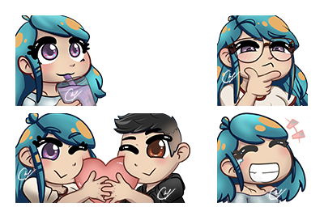
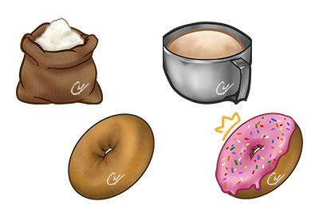
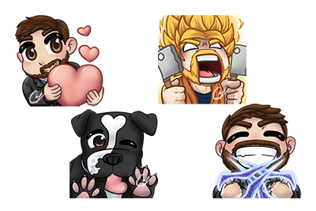
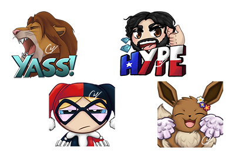
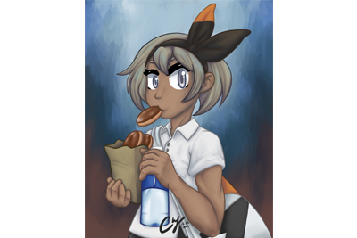
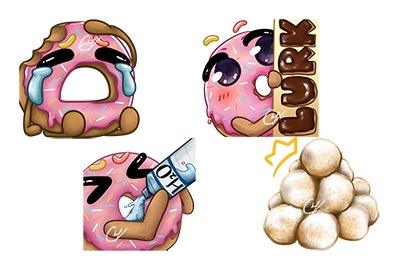

<html lang="en">
<head>
<meta charset="utf-8">
<meta name="viewport" content="width=device-width, initial-scale=1">
<title>Chefshire - Artist / Twitch Affiliate</title>
<meta name="description" content="">
<meta name="author" content="">

<!-- Favicons
    ================================================== -->
<link rel="shortcut icon" href="img/favicon.ico" type="image/x-icon">
<link rel="apple-touch-icon" href="img/apple-touch-icon.png">
<link rel="apple-touch-icon" sizes="72x72" href="img/apple-touch-icon-72x72.png">
<link rel="apple-touch-icon" sizes="114x114" href="img/apple-touch-icon-114x114.png">

<!-- Bootstrap -->
<link rel="stylesheet" type="text/css"  href="css/bootstrap.css">
<link rel="stylesheet" type="text/css" href="fonts/font-awesome/css/font-awesome.css">

<!-- Stylesheet
    ================================================== -->
<link rel="stylesheet" type="text/css"  href="css/style.css">
<link rel="stylesheet" type="text/css" href="css/nivo-lightbox/nivo-lightbox.css">
<link rel="stylesheet" type="text/css" href="css/nivo-lightbox/default.css">
<link href="https://fonts.googleapis.com/css?family=Montserrat:400,700" rel="stylesheet">
<link href="https://fonts.googleapis.com/css?family=Roboto:300,400,500,700,900" rel="stylesheet">

<!-- HTML5 shim and Respond.js for IE8 support of HTML5 elements and media queries -->
<!-- WARNING: Respond.js doesn't work if you view the page via file:// -->
<!--[if lt IE 9]>
      
      
    <![endif]-->
</head>
<body>
<!-- Header -->
<header id="header">
  

    

      

        

          

            

              <h1>Chefshire</h1>
              
Artist / Twitch Affiliate

              <a href="#portfolio" class="btn btn-custom btn-lg page-scroll">Portfolio</a> <a href="#contact" class="btn btn-custom btn-lg page-scroll">About Me</a> 

          

        

      

    

  

</header>
<!-- Portfolio Section -->

  

    

      <h2>Portfolio</h2>
    

    

      <ul class="cat">
        <li>
          <ol class="type">
            <li><a href="#" data-filter="*" class="active">All</a></li>
            <li><a href="#" data-filter=".lorem">Emotes</a></li>
            <li><a href="#" data-filter=".dolor">Sub Badges</a></li>
            <li><a href="#" data-filter=".adipiscing">Illustrations</a></li>
          </ol>
        </li>
      </ul>
    

    

      

        

          

            
 <a href="img/portfolio/01-large.png" title="ChefLove" data-lightbox-gallery="gallery1">
              

                

                  

                    <h4>ChefLove</h4>
                  

                

              

               </a> 

          

        

        

          

            
 <a href="img/portfolio/02-large.png" title="DubuLove" data-lightbox-gallery="gallery1">
              

                

                  

                    <h4>DubuLove</h4>
                  

                

              

               </a> 

          

        

        

          

            
 <a href="img/portfolio/03-large.png" title="ChefHmm" data-lightbox-gallery="gallery1">
              

                

                  

                    <h4>ChefHmm</h4>
                  

                

              

               </a> 

          

        

        

          

            
 <a href="img/portfolio/04-large.png" title="ChefSip" data-lightbox-gallery="gallery1">
              

                

                  

                    <h4>ChefSip</h4>
                  

                

              

               </a> 

          

        

        

          

            
 <a href="img/portfolio/05-large.png" title="ChefLaugh" data-lightbox-gallery="gallery1">
              

                

                  

                    <h4>ChefLaugh</h4>
                  

                

              

               </a> 

          

        

        

          

            
 <a href="img/portfolio/06-large.png" title="Ara Ara" data-lightbox-gallery="gallery1">
              

                

                  

                    <h4>Ara ArA</h4>
                  

                

              

               </a> 

          

        

        

          

            
 <a href="img/portfolio/07-large.png" title="Portal" data-lightbox-gallery="gallery1">
              

                

                  

                    <h4>Portal</h4>
                  

                

              

               </a> 

          

        

        

          

            
 <a href="img/portfolio/08-large.png" title="Deku" data-lightbox-gallery="gallery1">
              

                

                  

                    <h4>Deku</h4>
                  

                

              

               </a> 

          

        

        

          

            
 <a href="img/portfolio/09-large.png" title="Bea	" data-lightbox-gallery="gallery1">
              

                

                  

                    <h4>Bea</h4>
                  

                

              

               </a> 

          

        

        

          

            
 <a href="img/portfolio/10-large.png" title="Project Title" data-lightbox-gallery="gallery1">
              

                

                  

                    <h4>Project Name</h4>
                  

                

              

               </a> 

          

        

        

          

            
 <a href="img/portfolio/11-large.png" title="Project Title" data-lightbox-gallery="gallery1">
              

                

                  

                    <h4>Project Name</h4>
                  

                

              

               </a> 

          

        

        

          

            
 <a href="img/portfolio/12-large.png" title="Project Title" data-lightbox-gallery="gallery1">
              

                

                  

                    <h4>Project Name</h4>
                  

                

              

               </a> 

          

        

        

          

            
 <a href="img/portfolio/13-large.png" title="Project Title" data-lightbox-gallery="gallery1">
              

                

                  

                    <h4>Project Name</h4>
                  

                

              

               </a> 

          

        

        

          

            
 <a href="img/portfolio/14-large.png" title="Project Title" data-lightbox-gallery="gallery1">
              

                

                  

                    <h4>Project Name</h4>
                  

                

              

               </a> 

          

        

        

          

            
 <a href="img/portfolio/15-large.png" title="Project Title" data-lightbox-gallery="gallery1">
              

                

                  

                    <h4>Project Name</h4>
                  

                

              

               </a> 

          

        

        

          

            
 <a href="img/portfolio/16-large.png" title="Project Title" data-lightbox-gallery="gallery1">
              

                

                  

                    <h4>Project Name</h4>
                  

                

              

               </a> 

          

        

        

          

            
 <a href="img/portfolio/17-large.png" title="Project Title" data-lightbox-gallery="gallery1">
              

                

                  

                    <h4>Project Name</h4>
                  

                

              

               </a> 

          

        

        

          

            
 <a href="img/portfolio/18-large.png" title="Project Title" data-lightbox-gallery="gallery1">
              

                

                  

                    <h4>Project Name</h4>
                  

                

              

               </a> 

          

        

      

    

  

<!-- Contact Section -->

  

    <h2>HIYA, I'M CHEF!</h2>
    

      

        
 
          
I'm a chemistry undergrad at a California State University. My hobbies include drawing, video games, and food. Fun fact: I sleep in class a lot.

		  
I really value people who stick around and stay active. I consider them part of my Retrotea family! Thank you for stopping by and I hope to see you back soon!

		  
I mostly play Monster Hunter: World, Rainbow Six: Siege, and Tekken 7 on PC. I typically do art streams first then move on to the game of the night before I pass the torch to another streamer with a raid. Let me know if you have any questions and I'll gladly answer them!

          

            <ul>
			   <li><a href="https://www.twitch.tv/chefshire/"><i class="fa fa-twitch"></i></a></li>
              <li><a href="https://twitter.com/chefshire1"><i class="fa fa-twitter"></i></a></li>
              <li><a href="https://www.instagram.com/chefshiretwitch/"><i class="fa fa-instagram"></i></a></li>
            </ul>
          

        

      

    

    

      

        
For commissions, please fill out this form: Commissions Form!

		
For other inquiries, please contact me by email at <strong>chefshiretwitch@gmail.com</strong> or fill out the form below.

      

      <form name="sentMessage" id="contactForm" novalidate>
        

          

            

              <input type="text" id="name" class="form-control" placeholder="Name" required="required">
              

            

          

          

            

              <input type="email" id="email" class="form-control" placeholder="Email" required="required">
              

            

          

        

        

          <textarea name="message" id="message" class="form-control" rows="4" placeholder="Message" required></textarea>
          

        

        

        <button type="submit" class="btn btn-default btn-lg">Send Message</button>
      </form>
    

  

  

    
&copy; 2020 Chefshire. All rights reserved.

  

 
 
 
 
 
 
 

</body>
</html>
